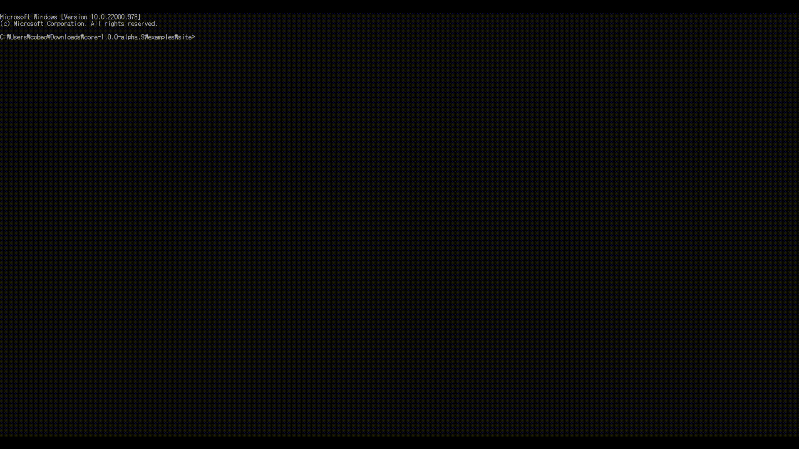

# 예제 파일 다운로드

만약 개발자라면 직접 구현이 가능하지만 그렇지 않다면 [예제 폴더](https://github.com/tigeuplus/core/tree/master/examples)을 다운로드하여 지갑 구동이 가능합니다.

<br/>
<br/>

# 프로젝트 구성

예제 폴더에서 주소창에 cmd를 입력하여 cmd를 실행하고 아래와 같이 실행해주세요



```npm i --save```

```npm start```