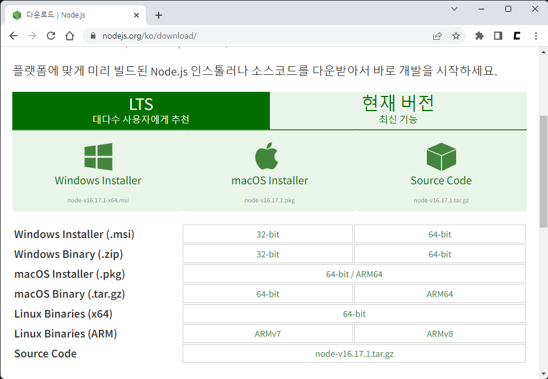

# Node.js 설치

[Node.js 설치 사이트](https://nodejs.org/ko/download)에 접속하여 Node.js를 설치합니다. *(자세한 내용은 [Node.js 사이트](https://nodejs.org/ko/download/package-manager/)에서 확인할 수 있습니다)*



<br/>
<br/>

```npm i --global typescript ts-node```를 이용하여 typescript와 ts-node를 설치합니다.