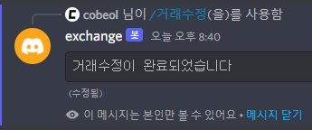

# 거래수정

거래를 수정합니다

<br/>

## 사용법

```
/거래수정 번호:[수정할 거래 번호] 수량:[수정할 수량](선택) 가격:[수정할 가격](선택) 
```

수량이나 가격은 선택이지만 하나라도 선택해야 합니다.

<br/>

## 예시

<br/>

### 수량만 선택




<br/>

### 가격만 선택


<br/>

### 수량, 가격 선택


