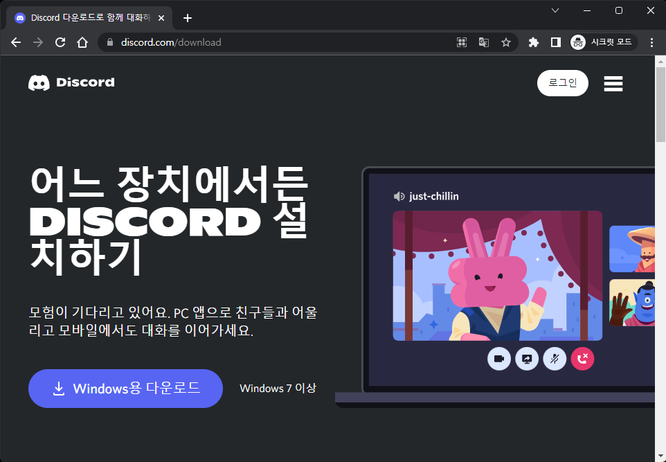
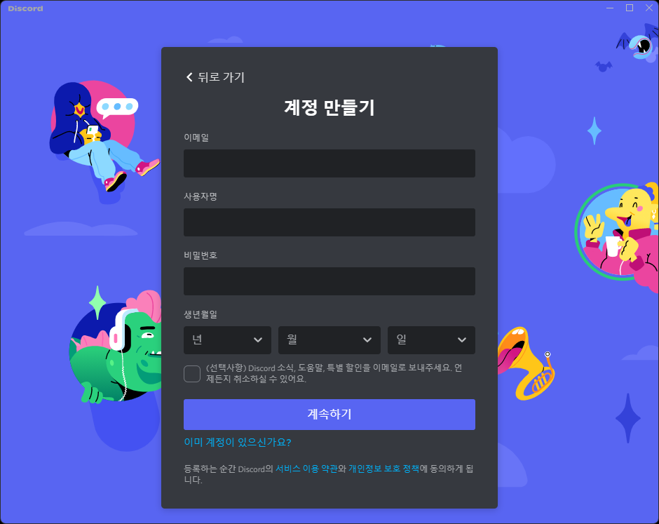

# 디스코드 회원가입

디스코드와 디스코드 계정이 이미 존재한다면 이 단계를 건너뛰어도 됩니다.

 

## 1. 디스코드 설치

[디스코드 다운로드 사이트](https://discord.com/download)에 들어가 자신에 맞는 OS를 선택 후 다운로드 받아 설치합니다.

 
 

## 2. 디스코드 회원가입

디스코드를 실행하고 계정 회원가입을 진행합니다.

 
 

## 3. 서버 접속하기

[링크](https://discord.gg/gNVhJUMpgk)를 클릭하여 사이트에 접속하여 디스코드 서버에 접속합니다

